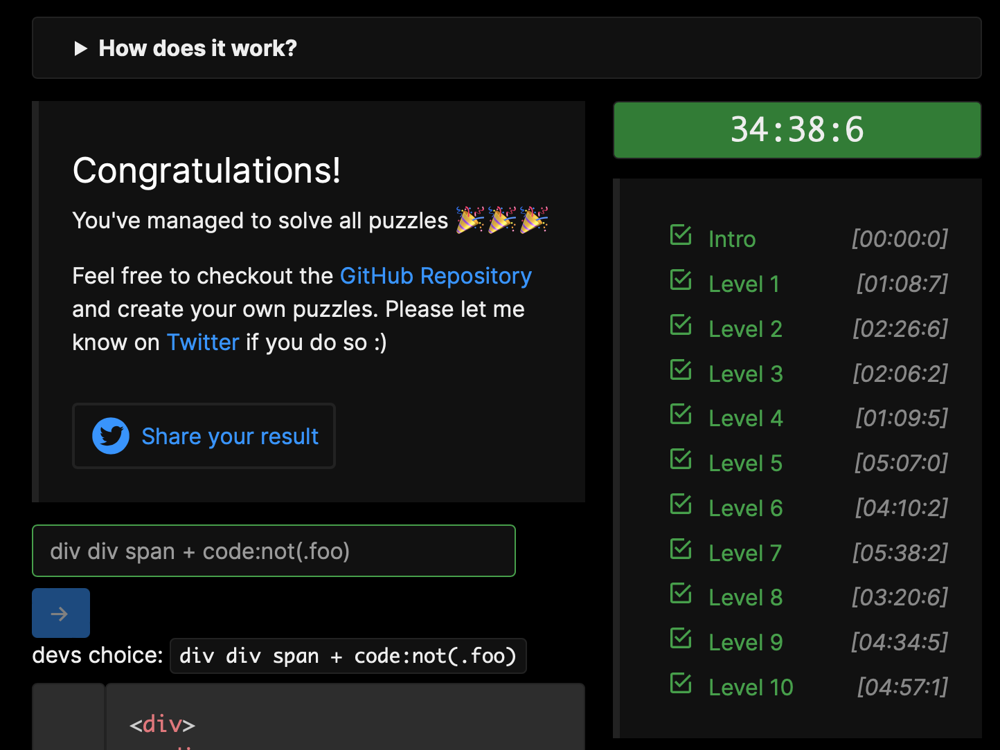

ul :first-child  
p:not(.foo)  
li:nth-of-type(2n+3)  
span:first-child,p    
    <b>devs choice: div > * </b>  
[data-item="foo"],[data-item="bar"]  
    <b>devs choice: span[data-item]</b>  
p ~ span  
input:enabled,button:enabled
    <b>devs choice: :enabled</b>  

#one,#two,#five,#six,#nine    
a + span  
#foo > .foo  
div div span + code:not(.foo)  
